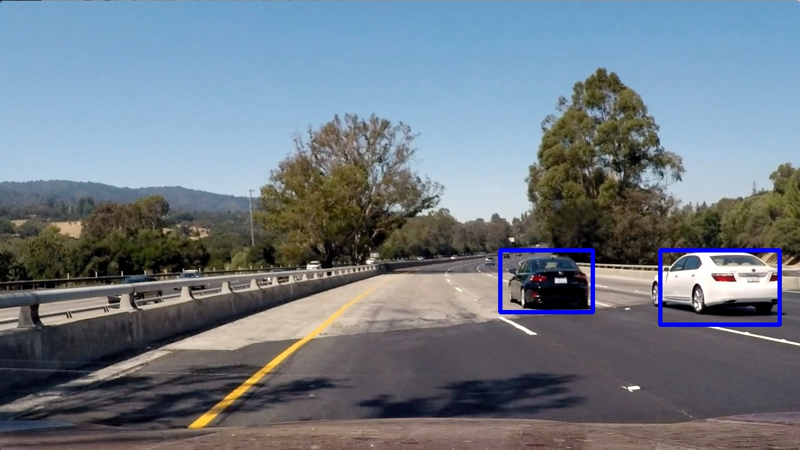

# Vehicle Detection

Overview
---

This repository is to submit the project outcome of [Udacity - Self-Driving Car NanoDegree - Vehicle Detection](https://github.com/udacity/CarND-Vehicle-Detection)

The goals / steps of this project are the following:

* Perform a Histogram of Oriented Gradients (HOG) feature extraction on a labeled training set of images and train a classifier Linear SVM classifier
* Optionally, you can also apply a color transform and append binned color features, as well as histograms of color, to your HOG feature vector. 
* Note: for those first two steps don't forget to normalize your features and randomize a selection for training and testing.
* Implement a sliding-window technique and use your trained classifier to search for vehicles in images.
* Run your pipeline on a video stream (start with the test_video.mp4 and later implement on full project_video.mp4) and create a heat map of recurring detections frame by frame to reject outliers and follow detected vehicles.
* Estimate a bounding box for vehicles detected.

Contents
---

1. [README](README.md)
1. Code
   1. [find_cars.py](find_cars.py) : Main program to execute pipeline
   1. [train_classifier.py](train_classifier.py) : Program to train classifier by Support Vector Machine  algorithm
   1. [bbox_filter.py](bbox_filter.py) : Utility to filter the bounding boxes by using heatmap
   1. [feature_tools.py](feature_tools.py) : Utility to get features from image
1. [Writeup Report](writeup_report.md)
1. [Output Video](output_videos/project_video.mp4)
1. [Output Images](output_images/)

LICENSE
---

MIT License
